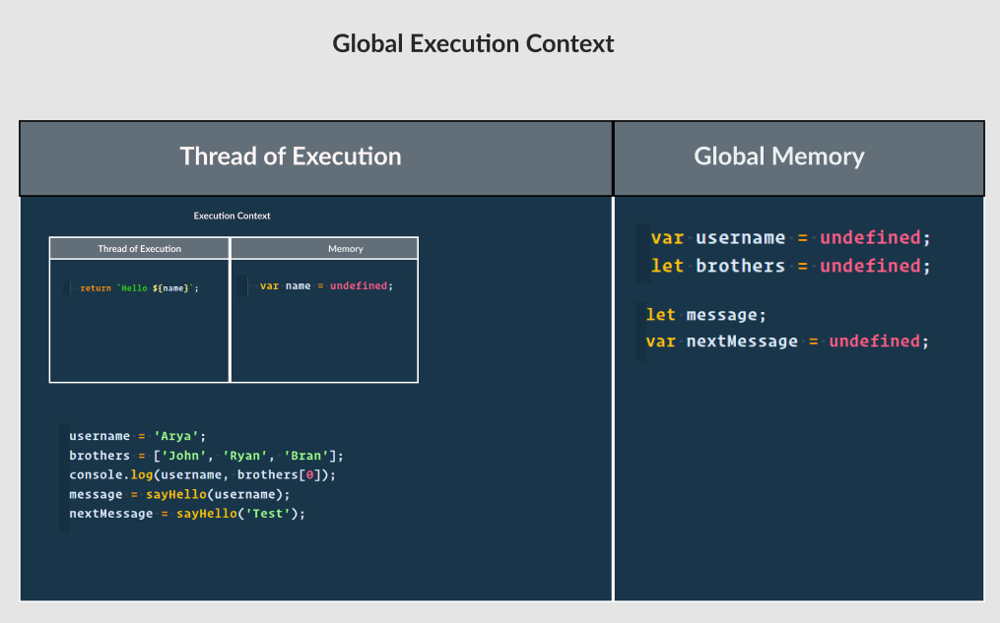
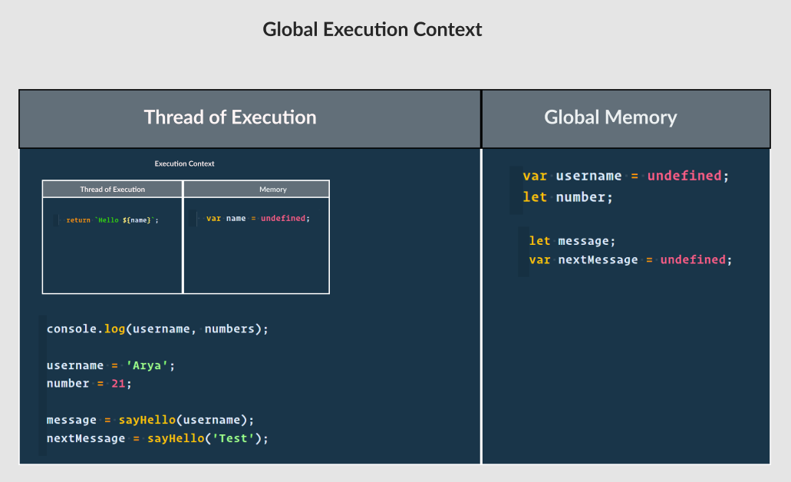
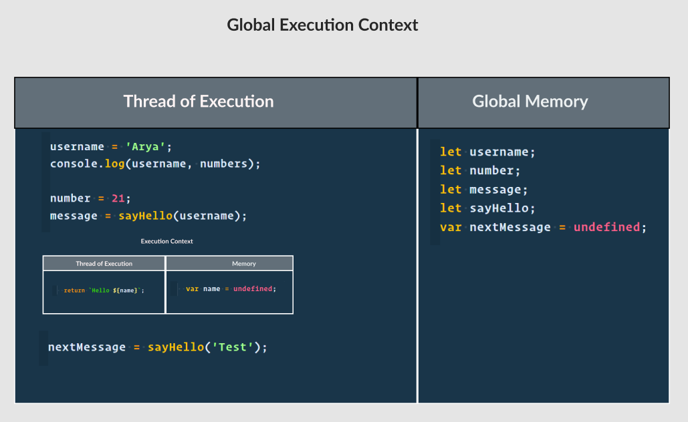
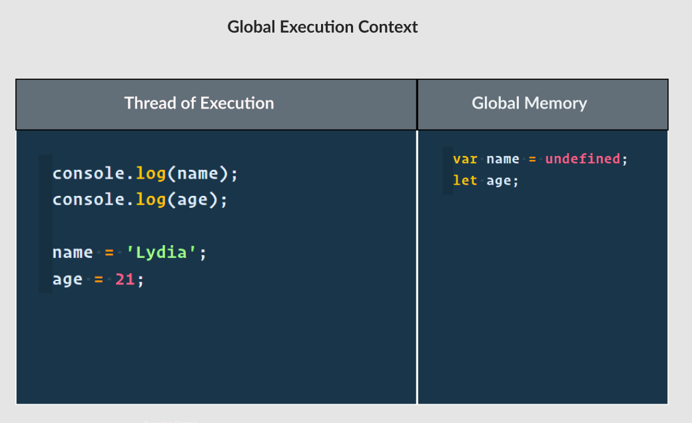
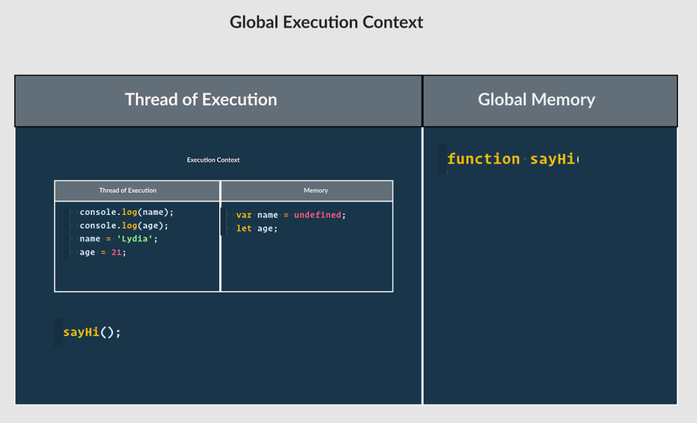
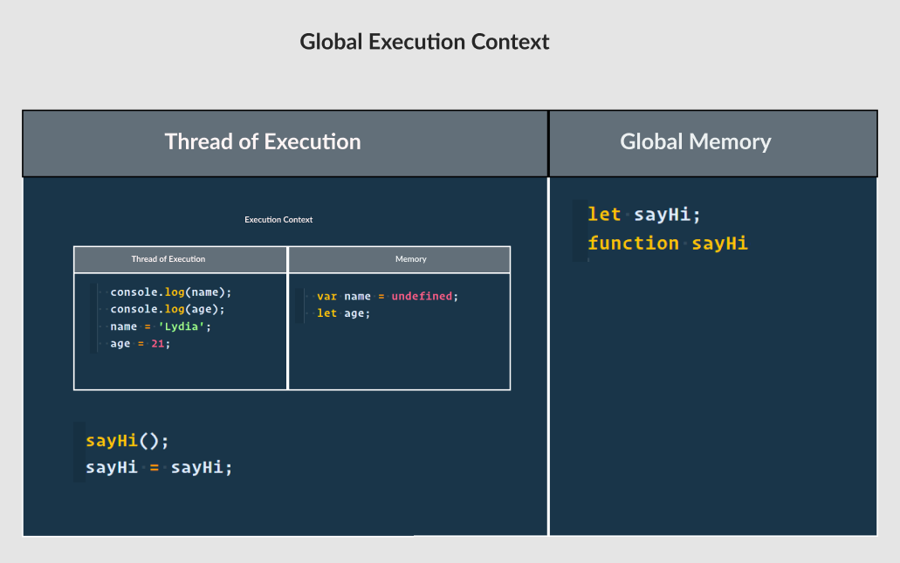
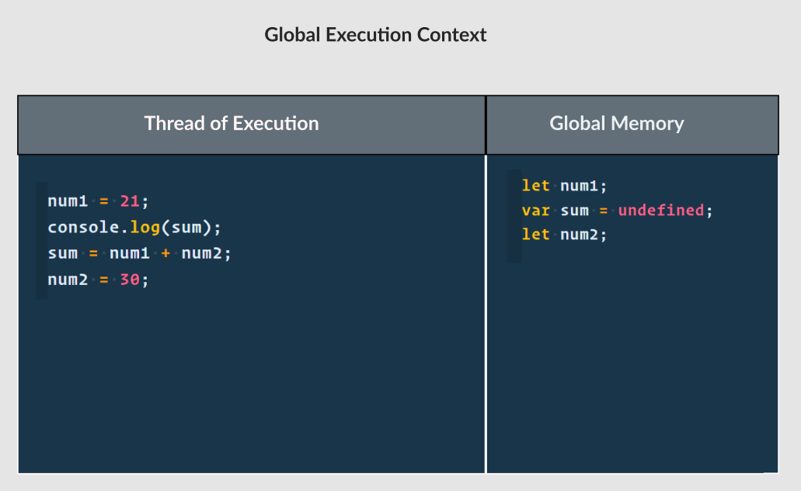
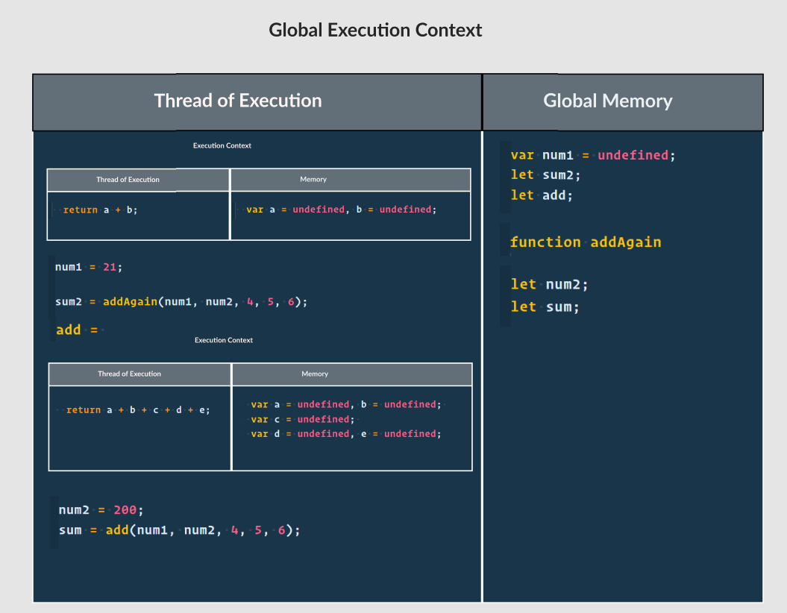
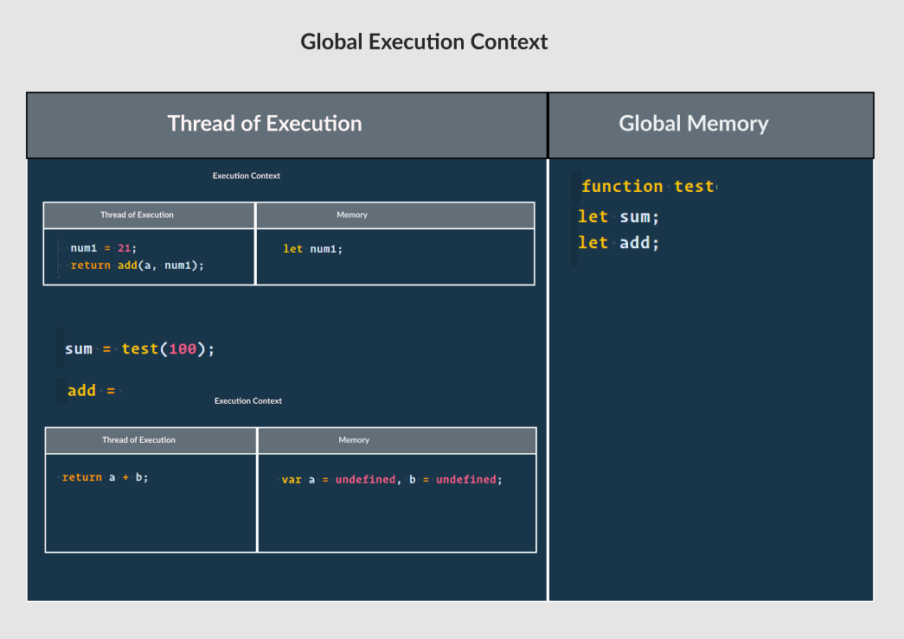
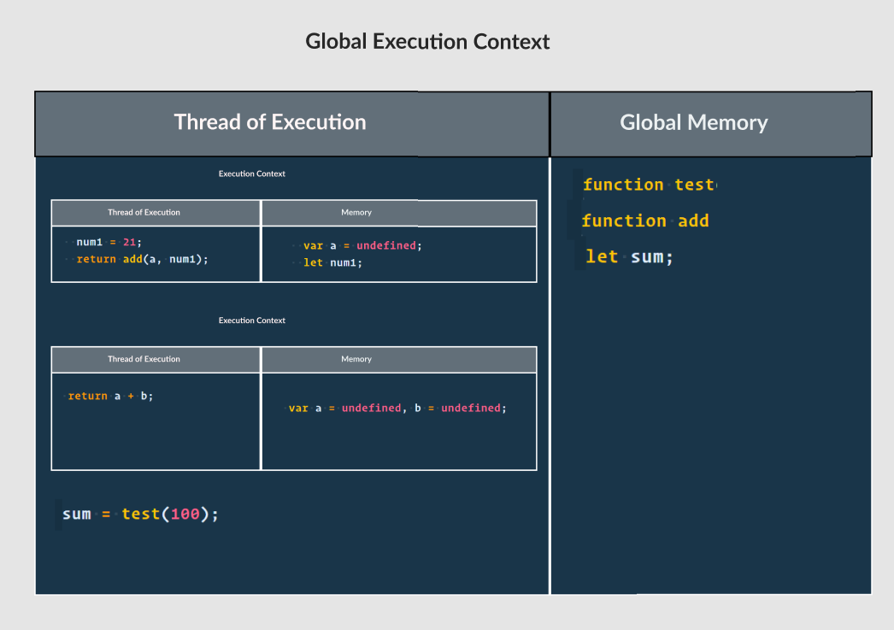

For the given code below:

- create the execution context diagram
- re-write the code in ways that system will understand/interprete

1.

```js
var username = 'Arya';
let brothers = ['John', 'Ryan', 'Bran'];

console.log(username, brothers[0]);

function sayHello(name) {
  return `Hello ${name}`;
}

let message = sayHello(username);
var nextMessage = sayHello('Test');
```

Compiling the code in Declaration Phase --

```js
var username = undefined;
let brothers = undefined;
function sayHello(name) {
  var name = undefined;
  return `Hello ${name}`;
}
let message;
var nextMessage = undefined;

username = 'Arya';
brothers = ['John', 'Ryan', 'Bran'];
console.log(username, brothers[0]);
message = sayHello(username);
nextMessage = sayHello('Test');

```


2.

```js
console.log(username, numbers);

var username = 'Arya';
let number = 21;

function sayHello(name) {
  return `Hello ${name}`;
}

let message = sayHello(username);
var nextMessage = sayHello('Test');
```

Compiling JS code in the Declaration phase


```js
var username = undefined;
let number;

function sayHello(name) {
  var name = undefined;
  return `Hello ${name}`;
}

let message;
var nextMessage = undefined;

console.log(username, numbers);

username = 'Arya';
number = 21;

message = sayHello(username);
nextMessage = sayHello('Test');

```



3.

```js
console.log(username, numbers);

let username = 'Arya';
let number = 21;

let sayHello = function (name) {
  return `Hello ${name}`;
};

let message = sayHello(username);
var nextMessage = sayHello('Test');
```

Compiling JS in Declaration Phase

```js
let username;
let number;
let sayHello;
let message;
var nextMessage = undefined;

console.log(username, numbers);
username = 'Arya';
number = 21;

sayHello = function(name) {
  var name = undefined;
  return `Hello ${name}`;
};

message = sayHello(username);
nextMessage = sayHello('Test');

```



4.

```js
let username = 'Arya';
console.log(username, numbers);

let number = 21;
let message = sayHello(username);

let sayHello = function (name) {
  return `Hello ${name}`;
};

var nextMessage = sayHello('Test');
```

Compiling JS in Declaration Phase

```js
let username;
let number;
let message;
let sayHello;
var nextMessage = undefined;

username = 'Arya';
console.log(username, numbers);

number = 21;
message = sayHello(username);

sayHello = function (name) {
  var name = undefined;
  return `Hello ${name}`;
};

nextMessage = sayHello('Test');

```


5.

```js
console.log(name);
console.log(age);
var name = 'Lydia';
let age = 21;
```

Compiling JS in Declaration Phase

```js
var name = undefined;
let age;

console.log(name);
console.log(age);

name = 'Lydia';
age = 21;
```



6.

```js
function sayHi(name) {
  console.log(name);
  console.log(age);
  var name = 'Lydia';
  let age = 21;
}

sayHi();
```

Compiling JS in Declaration Phase

```js
function sayHi(name) {
  var name = undefined;
  let age;
  console.log(name);
  console.log(age);
  name = 'Lydia';
  age = 21;
}

sayHi();

```



7.

```js
sayHi();
let sayHi = function sayHi(name) {
  console.log(name);
  console.log(age);
  var name = 'Lydia';
  let age = 21;
};
```

Compiling JS in Declaration Phase

```js
let sayHi;
function sayHi(name) {
  var name = undefined;
  let age;
  console.log(name);
  console.log(age);
  name = 'Lydia';
  age = 21;
};

sayHi();
sayHi = sayHi;
```



8.

```js
let num1 = 21;
console.log(sum);
var sum = num1 + num2;
let num2 = 30;
```

Compiling JS in Declaration Phasee

```js

let num1;
var sum = undefined;
let num2;

num1 = 21;
console.log(sum);
sum = num1 + num2;
num2 = 30;

```



9.

```js
var num1 = 21;

let sum2 = addAgain(num1, num2, 4, 5, 6);

let add = (a, b, c, d, e) => {
  return a + b + c + d + e;
};
function addAgian(a, b) {
  return a + b;
}
let num2 = 200;

let sum = add(num1, num2, 4, 5, 6);
```

Compiling JS in Declaration Phase

```js

var num1 = undefined;
let sum2;
let add;

function addAgain(a, b) {
  var a = undefined, b = undefined;
  return a + b;
}

let num2;
let sum;

num1 = 21;

sum2 = addAgain(num1, num2, 4, 5, 6);

add = (a, b, c, d, e) => {
  var a = undefined, b = undefined, c = undefined, d = undefined, e = undefined;
  return a + b + c + d + e;
};

num2 = 200;
sum = add(num1, num2, 4, 5, 6);

```



10.

```js
function test(a) {
  let num1 = 21;
  return add(a, num1);
}

let sum = test(100);

let add = (a, b) => {
  return a + b;
};
```

Compiling JS in Declaration Phase

```js
function test(a) {
  let num1;
  num1 = 21;
  return add(a, num1);
}
let sum;
let add;

sum = test(100);

add = (a, b) => {
  var a = undefined, b = undefined;
  return a + b;
};
```



11.

```js
function test(a) {
  var a = undefined;
  let num1 = 21;
  return add(a, num1);
}

let sum = test(100);

function add(a, b) {
  return a + b;
}
```

Compiling JS in Declaration Phase

```js

function test(a) {
  var a = undefined;
  let num1;
  num1 = 21;
  return add(a, num1);
}

function add(a, b) {
  var a = undefined, b = undefined;
  return a + b;
}

let sum;
sum = test(100);

```

